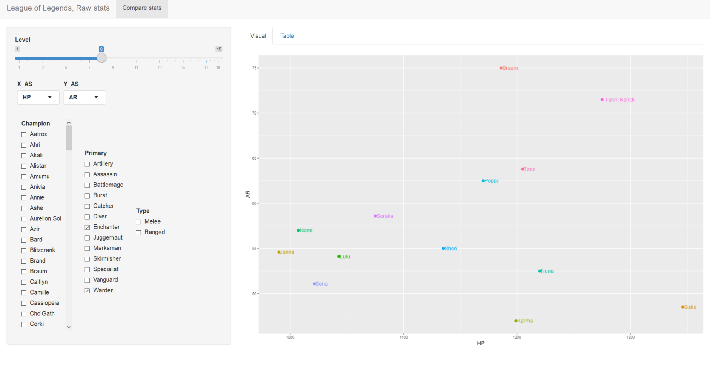

# League_of_Legends

In this app you can compare champs their basestats from level 1 tot 18. The comparison is in a resonsive liniair diagram. You can change the x-axis ans Y-axis yourself and the same with the level. It's posible to only show one champ or all rangers or jugernauts.

<h3>
Problems
</h3>
<ul>
  <li>I dont have the league of legends api, so these stats aren't acurate. Also, there is no AP in this sheet.</li>
  <li>The inputs aren't reactive to eachother</li>
  </ul>

  <h3>
Todo
  </h3>
<ul>
  <li>Table needs some css: DataTable</li>
  <li>text: about this</li>
  <li>Stats per champ</li>
  <ul>
    <li>choose champ</li>
<li>Choose level</li>
  <li>Titel = selected champ</li>
    <li>Autoselected champ = AAA</li>
      <li>Star with stats</li>
    </ul>
  </ul>
